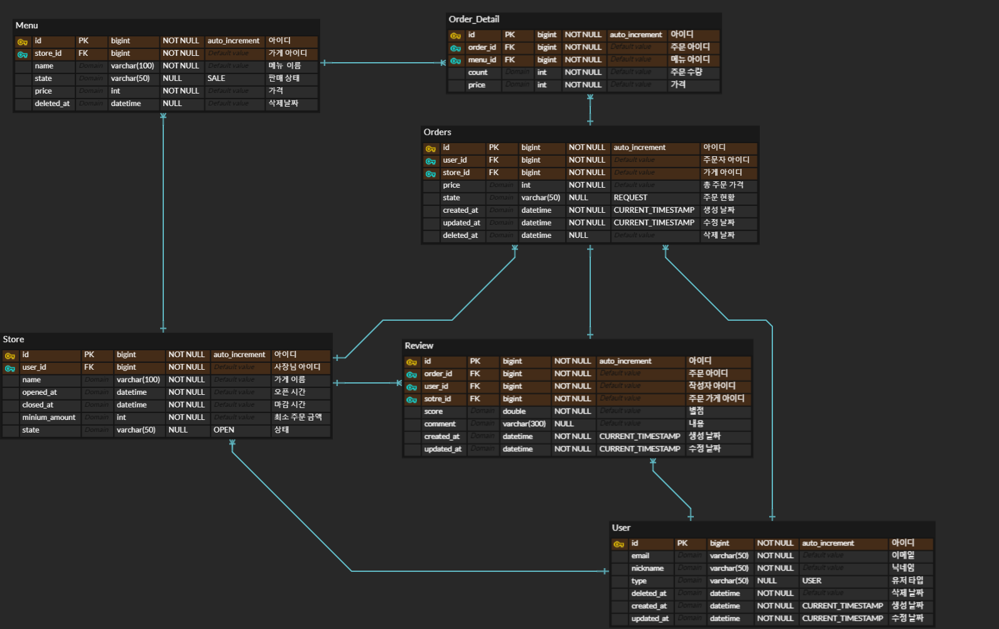

# 9조 아웃소싱 프로젝트
## 1. 팀원 소개
<table style="width:100%; text-align:center;">
  <tr>
    <td>
      <br>
      <strong>팀장 서민기</strong><br>
      로그인 및 회원가입 기능 개발 
    </td>
    <td>
      <br>
      <strong>팀원 김명훈</strong><br>
      메뉴 (생성,수정,삭제) 및 Docker설정 기능 개발
    </td>
    <td>
      <br>
      <strong>팀원 김도현</strong><br>
      가게 생성 및 가게 정보 (수정,조회,삭제), 가게 단건 조회 기능 개발
    </td>
    <td>
      <br>
      <strong>팀원 김현정</strong><br>
      주문(요청, 조회, 상태 수정) 리뷰(생성, 조회, 수정, 삭제) 및 인증/인가
    </td>
  </tr>
</table>

## 2. 주요 백엔드 사용 기술

<div align="center">
    
</div>

- **Spring Boot**: 애플리케이션의 주요 서버 사이드 프레임워크로 사용됩니다.
- **JPA (Java Persistence API)**: 데이터베이스와의 상호작용을 관리하는 데 사용됩니다.
- **MySQL**: 데이터 저장 및 관리에 사용되는 관계형 데이터베이스입니다.
- **JWT (JSON Web Token)**: 사용자 인증 및 보안 관리를 위해 사용됩니다.

## 3. 기능 소개 


### 사장님 회원가입 시

<div align="center">
    
</div>

<hr style="border: 1px solid #ccc; width: 80%; margin: 20px auto;">

### 유저 회원가입 시

<div align="center">
    
</div>

## 와이어 프레임


## 4. ERD 다이어그램


## 5. API 명세서
<table>
    <tr>
        <th>api&nbsp;&nbsp;&nbsp;&nbsp;&nbsp;&nbsp;&nbsp;&nbsp;&nbsp;&nbsp;&nbsp;&nbsp;&nbsp;&nbsp;</th>
        <th>Method</th>
        <th>URL</th>
        <th>request header</th>
        <th>request</th>
        <th>response header</th>
        <th>response</th>                               
<th>status&nbsp;&nbsp;&nbsp;&nbsp;&nbsp;&nbsp;&nbsp;&nbsp;&nbsp;&nbsp;&nbsp;&nbsp;&nbsp;&nbsp;&nbsp;&nbsp;&nbsp;&nbsp;&nbsp;&nbsp;&nbsp;&nbsp;&nbsp;&nbsp;&nbsp;&nbsp;&nbsp;&nbsp;&nbsp;&nbsp;&nbsp;&nbsp;&nbsp;&nbsp;&nbsp;&nbsp;&nbsp;&nbsp;&nbsp;&nbsp;&nbsp;&nbsp;&nbsp;&nbsp;&nbsp;&nbsp;&nbsp;&nbsp;&nbsp;&nbsp;
        </th>
    </tr>
    <tr>
        <td><b>사장님<br/>회원가입</b></td>
        <td><span style=background-color:#786E12AA;font-weight:bold;>POST</span></td>
        <td><span>/api/owners/register</span></td>
        <td>RequestBody</td>
        <td><pre lang="json">{
  "username": "홍길동",
  "email": "hong@email.com",
  "password": "1q2w3e4r#"
}</pre></td>
        <td>application/json</td>
        <td><pre lang="json">{
  "userId": 2,
  "nickname": "홍길동",
  "email": "hong@email.com"
}</pre></td>
        <td>
            <span style=background-color:yellow;font-weight:bold;color:black;>201</span>: 사용자 정상등록<br/>
            <span style=background-color:skyblue;font-weight:bold;color:black;>409</span>: 중복된 이메일
        </td>
    </tr>
    <tr>
        <td><b>유저<br/>회원가입</b></td>
        <td><span style=background-color:#786E12AA;font-weight:bold;>POST</span></td>
        <td><span>/api/owners/register</span></td>
        <td>RequestBody</td>
        <td><pre lang="json">{
  "username": "홍길동",
  "email": "hong@email.com",
  "password": "1q2w3e4r#"
}</pre></td>
        <td>application/json</td>
        <td><pre lang="json">{
  "userId": 2,
  "nickname": "홍길동",
  "email": "hong@email.com"
}</pre></td>
        <td>
            <span style=background-color:yellow;font-weight:bold;color:black;>201</span>: 사용자 정상등록<br/>
            <span style=background-color:skyblue;font-weight:bold;color:black;>409</span>: 중복된 이메일
        </td>
    </tr>    
    <tr>
        <td><b>로그인</b></td>
        <td><span style=background-color:#786E12AA;font-weight:bold;>POST</span></td>
        <td><span>/api/users/register</span></td>
        <td>RequestBody</td>
        <td><pre lang="json">{
  "email": "hong@email.com",
  "password": "1q2w3e4r#"
}</pre></td>
        <td>application/json</td>
        <td><pre lang="json">{
  "userId": 2,
  "nickname": "홍길동",
  "email": "hong@email.com"
}</pre></td>
        <td>
            <span style=background-color:yellow;font-weight:bold;color:black;>200</span>: 로그인 성공<br/>
            <span style=background-color:skyblue;font-weight:bold;color:black;>400</span>: 잘못된 값 입력<br/>
            <span style=background-color:skyblue;font-weight:bold;color:black;>401</span>: 일치하지 않는 비밀번호<br/>
            <span style=background-color:skyblue;font-weight:bold;color:black;>404</span>: 존재하지 않는 유저
        </td>
    </tr>
    <tr>
        <td><b>사용자<br/>수정</b></td>
        <td><span style=background-color:#3B36CFAA;font-weight:bold;>PUT</span></td>
        <td><span>/api/users</span></td>
        <td>RequestBody</td>
        <td><pre lang="json">{
  "username": "이길동",
  "email": "park@email.com",
  "password": "1234"
}</pre></td>
        <td>application/json</td>
        <td><pre lang="json">{
  "userId": 3,
  "nickname": "이길동",
  "email": "park@email.com"
}</pre></td>
        <td>
            <span style=background-color:yellow;font-weight:bold;color:black;>200</span>: 사용자 정상수정<br/>
            <span style=background-color:skyblue;font-weight:bold;color:black;>404</span>: 존재하지 않는 유저
        </td>
    </tr>
    <tr>
        <td><b>사용자<br/>삭제</b></td>
        <td><span style=background-color:#CE3636AA;font-weight:bold;>DELETE</span></td>
        <td><span>/api/users</span></td>
        <td>RequestBody</td>
        <td><code>N/A</code></td>
        <td>application/json</td>
        <td><code>N/A</code></td>
        <td>
            <span style=background-color:yellow;font-weight:bold;color:black;>204</span>: 사용자 정상삭제<br/>
            <span style=background-color:skyblue;font-weight:bold;color:black;>404</span>: 존재하지 않는 유저
        </td>
    </tr>
    <tr>
        <td><b>가게 생성</b></td>
        <td><span style=background-color:#786E12AA;font-weight:bold;>POST</span></td>
        <td><span>/api/stores</span></td>
        <td>RequestBody</td>
        <td><pre lang="json">{
  "name": "김밥천국",
  "openedAt": "09:00:00",
  "closedAt": "23:59:00",
  "minimumAmount": 5000
}</pre></td>
        <td>application/json</td>
        <td><pre lang="json">{
  "id": 1,
  "name": "김밥천국",
  "openedAt": "09:00",
  "closedAt": "23:59",
  "minimumAmount": 5000
}</pre></td>
        <td>
            <span style=background-color:yellow;font-weight:bold;color:black;>201</span>: 가게 등록 성공
        </td>
    </tr>
    <tr>
        <td><b>가게 조회(전체)</b></td>
        <td><span style=background-color:#22741CAA;font-weight:bold;>GET</span></td>
        <td><span>/api/stores?<br/>name={storeName}&<br/>page={page}<br/>&size={size}</span></td>
        <td>PathVariable<br/>RequestParam</td>
        <td><code>N/A</code></td>
        <td>allpication/json</td>
        <td><pre lang="json">{
  "contents": 
  [
    {
      "id": 1,
      "name": "홍콩반점 수정",
      "openedAt": "05:00",
      "closedAt": "23:59",
      "minimumAmount": 10000
    }
  ],
  "page": 1,
  "size": 10,
  "totalPage": 1
}</pre></td>
        <td>
            <span style=background-color:yellow;font-weight:bold;color:black;>200</span>: 가게 조회(전체)
        </td>
    </tr>
        <td><b>가게 조회(단건)</b></td>
        <td><span style=background-color:#22741CAA;font-weight:bold;>GET</span></td>
        <td><span>/api/strore/{storeId}</span></td>
        <td>PathVariable</td>
        <td><code>N/A</code></td>
        <td>allpication/json</td>
        <td><pre lang="json">{
  "id": 1,
  "name": "김밥천국",
  "openedAt": "09:00",
  "closedAt": "23:59",
  "minimumAmount": 5000,
  "menus": 
  [
    {
      "id": 1,
      "name": "김치볶음밥",
      "price": 100,
      "state": null,
      "deletedAt": null
    }
  ]
}</pre></td>
        <td>
            <span style=background-color:yellow;font-weight:bold;color:black;>200</span>: 가게 조회(단건)
        </td>
    </tr>    
    <tr>
        <td><b>가게 수정</b></td>
        <td><span style=background-color:#3B36CFAA;font-weight:bold;>PUT</span></td>
        <td><span>/api/store/{storeId}</span></td>
        <td>PathVariable<br/>RequestBody</td>
        <td><pre lang="json">{
  "name": "홍콩반점",
  "openedAt": "05:00:00",
  "closedAt": "23:59:00",
  "minimumAmount": 10000
}</pre></td>
        <td>application/json</td>
        <td><pre lang="json">{
  "id": 1,
  "name": "홍콩반점 수정",
  "openedAt": "05:00",
  "closedAt": "23:59",
  "minimumAmount": 10000
}</pre></td>
        <td>
            <span style=background-color:yellow;font-weight:bold;color:black;>200</span>: 가게 수정 성공
        </td>
    </tr>
    <tr>
        <td><b>가게 폐업</b></td>
        <td><span style=background-color:#CE3636AA;font-weight:bold;>DELETE</span></td>
        <td><span>/api/store/{storeId}</span></td>
        <td>PathVariable</td>
        <td><code>N/A</code></td>
        <td>application/json</td>
        <td><code>N/A</code></td>
        <td>
            <span style=background-color:yellow;font-weight:bold;color:black;>204</span>: 가계 폐업<br/>
        </td>
    </tr>
    <tr>
        <td><b>메뉴 생성</b></td>
        <td><span style=background-color:#786E12AA;font-weight:bold;>POST</span></td>
        <td><span>/api/store/{storeId}</span></td>
        <td>RequestParam<br/>RequestBody</td>
        <td><pre lang="json">{
  "name" : "김치볶음밥",
  "price" : 100,
  "state" : "SALE"
}</pre></td>
        <td>application/json</td>
        <td><pre lang="json">{
  "id" : 1,
  "name" : "빅맥",
  "price" : 10000,
  "state" : "SALE" // SALE, STOP
}</pre></td>
        <td>
            <span style=background-color:yellow;font-weight:bold;color:black;>201</span>: 메뉴 등록 성공
        </td>
    </tr>  
    <tr>
        <td><b>메뉴 수정</b></td>
        <td><span style=background-color:#3B36CFAA;font-weight:bold;>PUT</span></td>
        <td><span>/api/stores/{storeId}<br/>/menus/{menuId}</span></td>
        <td>PathVariable<br/>RequestBody</td>
        <td><pre lang="json">{
  "name" : "치즈 돈까스",
  "price" : 10000,
  "state" : "SALE_STOP"
}</pre></td>
        <td>application/json</td>
        <td><pre lang="json">{
  "id": 1,
  "name": "빅맥세트999",
  "price": 10000,
  "state": "SALE_STOP",
  "deletedAt": null
}</pre></td>
        <td>
            <span style=background-color:yellow;font-weight:bold;color:black;>200</span>: 메뉴 수정 성공
        </td>
    </tr>    
    <tr>
        <td><b>메뉴 삭제</b></td>
        <td><span style=background-color:#CE3636AA;font-weight:bold;>DELETE</span></td>
        <td><span>/api/menu/{storeId}<br/>/menu/{menuId}</span></td>
        <td>PathVariable</td>
        <td><code>N/A</code></td>
        <td>application/json</td>
        <td><code>N/A</code></td>
        <td>
            <span style=background-color:yellow;font-weight:bold;color:black;>204</span>: 메뉴 삭제 성공<br/>
        </td>
    </tr>
    <tr>
        <td><b>주문 요청</b></td>
        <td><span style=background-color:#786E12AA;font-weight:bold;>POST</span></td>
        <td><span>/api/stores/{storeId}/orders</span></td>
        <td>RequestParam<br/>RequestBody</td>
        <td><pre lang="json">{
  "orderDetails": 
  [
    {
      "menuId": 1,
      "count": 1
    },
    {
      "menuId": 2,
      "count": 2
    }
  ]
}</pre></td>
        <td>application/json</td>
        <td><pre lang="json">{
  "id": 1,
  "storeId": 1,
  "storeName": "김밥천국",
  "orderState": "REQUEST",
  "totalPrice": 400,
  "createdAt": "2024-11-06T23:53:45.2758859",
  "updatedAt": "2024-11-06T23:53:45.2758859",
  "orderDetails": [
    {
      "id": 1,
      "menuId": 1,
      "menuName": "김치볶음밥",
      "count": 1,
      "price": 100
    }   
  ]
}</pre></td>
        <td>
            <span style=background-color:yellow;font-weight:bold;color:black;>201</span>: 주문 요청 성공<br/>
            <span style=background-color:skyblue;font-weight:bold;color:black;>400</span>: 가계 폐업<br/>
            <span style=background-color:skyblue;font-weight:bold;color:black;>400</span>: 영업 시간이 아님
        </td>
    </tr>
    <tr>
        <td><b>주문 조회(주문자)</b></td>
        <td><span style=background-color:#22741CAA;font-weight:bold;>GET</span></td>
        <td><span>/api/orders?<br/>page={page}&size={size}</span></td>
        <td>>RequestParam</td>
        <td><code>N/A</code></td>
        <td>allpication/json</td>
        <td><pre lang="json">{
  "data": [
    {
      "id": 1,
      "storeId": 1,
      "storeName": "김밥천국",
      "orderState": "REQUEST",
      "totalPrice": 410,
      "createdAt": "2024-11-06T23:53:45.275886",
      "updatedAt": "2024-11-06T23:53:45.28787",
      "orderDetails": 
      [
        {
          "id": 1,
          "menuId": 1,
          "menuName": "김치볶음밥",
          "count": 1,
          "price": 100
         },
      ],
    }
  ]  
  "page": 1,
  "size": 10,
  "totalPage": 1
}</pre></td>
        <td>
            <span style=background-color:yellow;font-weight:bold;color:black;>200</span>: 주문 조회 성공
        </td>
    </tr>    
    <tr>
        <td><b>주문 조회(가게)</b></td>
        <td><span style=background-color:#22741CAA;font-weight:bold;>GET</span></td>
        <td><span>/api/stores/{storeId}/orders?<br/>page={page}&size={size}</span></td>
        <td>PathVariable<br/>RequestParam</td>
        <td><code>N/A</code></td>
        <td>allpication/json</td>
        <td><pre lang="json">{
  "data": [
    {
      "id": 1,
      "storeId": 1,
      "storeName": "김밥천국",
      "orderState": "REQUEST",
      "totalPrice": 410,
      "createdAt": "2024-11-06T23:53:45.275886",
      "updatedAt": "2024-11-06T23:53:45.28787",
      "orderDetails": 
      [
        {
          "id": 1,
          "menuId": 1,
          "menuName": "김치볶음밥",
          "count": 1,
          "price": 100
         },
      ],
    }
  ]  
  "page": 1,
  "size": 10,
  "totalPage": 1
}</pre></td>
        <td>
            <span style=background-color:yellow;font-weight:bold;color:black;>200</span>: 주문 조회 성공
        </td>
    </tr> 
    <tr>
        <td><b>주문 상태 변경</b></td>
        <td><span style=background-color:#3B36CFAA;font-weight:bold;>PUT</span></td>
        <td><span>/api/order/{orderId}</span></td>
        <td>PathVariable<br/>RequestBody</td>
        <td><pre lang="json">{
    "state": "COMPLETE"
}</pre></td>
        <td>allpication/json</td>
        <td><pre lang="json">{
  "id": 1,
  "storeId": 2,
  "storeName": "김천",
  "orderState": "COMPLETE",
  "totalPrice": 10200,
  "createdAt": "2024-11- 06T17:00:02.358614",
  "updatedAt": "2024-11- 06T17:00:02.376533",
  "orderDetails": []
}</pre></td>
        <td>
            <span style=background-color:yellow;font-weight:bold;color:black;>200</span>: 주문 상태 변경<br/>
            <span style=background-color:skyblue;font-weight:bold;color:black;>400</span>: 주문을 취소하려할 때 이미 주문이 접수됐을 경우<br/>
            <span style=background-color:skyblue;font-weight:bold;color:black;>400</span>: 이미 배달을 완료했을 경우
        </td>
    </tr>                    
    <tr>
        <td><b>리뷰 등록</b></td>
        <td><span style=background-color:#786E12AA;font-weight:bold;>POST</span></td>
        <td><span>/api/stores/{storeId}<br/>/orders/{orderId}/reviews</span></td>
        <td>PathVariable<br/>RequestBody</td>
        <td><pre lang="json">{
  "score": 4.5,
  "comment": "맛있어요!"
}</pre></td>
        <td>application/json</td>
        <td><pre lang="json">{
  "id": 1,
  "userId": 1,
  "name": "홍길동",
  "score": 4.5,
  "comment": "맛있어요!",
  "createdAt": "2024-11-03 20:30:00",
  "updatedAt": "2024-11-03 20:40:00"   
}</pre></td>
        <td>
            <span style=background-color:yellow;font-weight:bold;color:black;>201</span>: 리뷰 등록 성공<br/>
            <span style=background-color:skyblue;font-weight:bold;color:black;>400</span>: 별점 미입력<br/>
            <span style=background-color:skyblue;font-weight:bold;color:black;>400</span>: 아직 배달이 완료되지 않음
        </td>
    </tr>
    <tr>
        <td><b>리뷰 조회<br/>(내가<br/>작성한)</b></td>
        <td><span style=background-color:#22741CAA;font-weight:bold;>GET</span></td>
        <td><span>/api/reviews?<br/>page={page}&size={size}</span></td>
        <td>PathVariable<br/>RequestParam</td>
        <td><code>N/A</code></td>
        <td>allpication/json</td>
        <td><pre lang="json">{
  "data": 
  [
    {
      "id": 1,
      "orderId": 1,
      "userId": 1,
      "name": "홍길동",
      "storeId": 1,
      "score": 4.5,
      "comment": "맛있어요!",
      "createdAt": "2024-11-03 20:30:00",
      "updatedAt": "2024-11-03 20:40:00"   
    }
  ], 
  "page": 1,
  "size": 10,
  "totalPage": 1
}</pre></td>
        <td>
            <span style=background-color:yellow;font-weight:bold;color:black;>200</span>: 리뷰 조회 성공
        </td>
    </tr>  
    <tr>
        <td><b>리뷰 조회(가게)</b></td>
        <td><span style=background-color:#22741CAA;font-weight:bold;>GET</span></td>
        <td><span>/api/stores/{storeId}/reviews?page={page}&size={size}</span></td>
        <td>PathVariable<br/>RequestParam</td>
        <td><code>N/A</code></td>
        <td>allpication/json</td>
        <td><pre lang="json">{
  "data": 
  [
    {
      "id": 1,
      "orderId": 1,
      "userId": 1,
      "name": "홍길동",
      "storeId": 1,
      "score": 4.5,
      "comment": "맛있어오!",
      "createdAt": "2024-11-03 20:30:00",
      "updatedAt": "2024-11-03 20:40:00"   
    }
  ], 
  "page": 1,
  "size": 10,
  "totalPage": 1
}</pre></td>
        <td>
            <span style=background-color:yellow;font-weight:bold;color:black;>200</span>: 리뷰 조회 성공
        </td>
    </tr>     
    <tr>
        <td><b>리뷰 조회(주문 건수에 대한)</b></td>
        <td><span style=background-color:#22741CAA;font-weight:bold;>GET</span></td>
        <td><span>/api/orders/{orderId}/reviews</span></td>
        <td>PathVariable</td>
        <td><code>N/A</code></td>
        <td>allpication/json</td>
        <td><pre lang="json">{
  "id": 1,
  "orderId": 1,
  "userId": 1,
  "name": "홍길동",
  "storeId": 1,
  "score": 4.5,
  "comment": "맛있어요!",
  "createdAt": "2024-11-03 20:30:00",
  "updatedAt": "2024-11-03 20:40:00"   
}</pre></td>
        <td>
            <span style=background-color:yellow;font-weight:bold;color:black;>200</span>: 리뷰 조회 성공
        </td>
    </tr>        
    <tr>
        <td><b>리뷰 수정</b></td>
        <td><span style=background-color:#3B36CFAA;font-weight:bold;>PUT</span></td>
        <td><span>/api/reivews/{reviewId}</span></td>
        <td>PathVariable<br/>RequestBody</td>
        <td><code>N/A</code></td>
        <td>allpication/json</td>        
        <td><pre lang="json">{
  "id": 1,
  "orderId": 1,
  "userId": 1,
  "name": "홍길동",
  "score": 5.0,
  "comment": "너무 맛있어요!",
  "createdAt": "2024-11-03 20:30:00",
  "updatedAt": "2024-11-03 20:40:00"   
}</pre></td>
        <td>
            <span style=background-color:yellow;font-weight:bold;color:black;>200</span>: 리뷰 수정 성공<br/>
            <span style=background-color:skyblue;font-weight:bold;color:black;>400</span>: 내가 작성한 리뷰가 아님<br/>
            <span style=background-color:skyblue;font-weight:bold;color:black;>404</span>: 존재하지 않는 댓글
        </td>
    </tr>
    <tr>
        <td><b>리뷰 삭제</b></td>
        <td><span style=background-color:#CE3636AA;font-weight:bold;>DELETE</span></td>
        <td><span>/api/reviews/{reviewId}</span></td>
        <td>PathVariable</td>
        <td><code>N/A</code></td>
        <td>application/json</td>
        <td><code>N/A</code></td>
        <td>
            <span style=background-color:yellow;font-weight:bold;color:black;>204</span>: 리뷰 삭제 성공<br/>
            <span style=background-color:skyblue;font-weight:bold;color:black;>400</span>: 내가 작성한 리뷰가 아님<br/>
            <span style=background-color:skyblue;font-weight:bold;color:black;>404</span>: 존재하지 않는 댓글
        </td>
    </tr>          
</table>

## 6. 프로젝트 구조
```bash
'com.sparta.n4delivery'
  ├─ 'common'                   # 공통으로 사용되는 것들을 모아놓은 폴더
  │   ├─ 'dto'
  │   ├─ 'util'                 # 비밀번호 암호화, jwt관련 클래스들이 있는 폴더
  │   └─ 'entity'
  ├─ 'config'                   # 프로젝트 설정 관련 class들을 모아놓은 폴더
  ├─ 'enums'                    # 프로젝트에서 사용되는 enum들을 모아놓은 폴더
  ├─ 'exception'                # 예외를 처리하기 위한 class들을 모아놓은 폴더
  ├─ 'filter'                   # 필터들을 모아놓은 폴더
  ├─ 'login'                    # 로그인 처리를 위한 class들을 모아놓은 폴더
  ├─ 'menu'
  │   ├─ 'controller'
  │   ├─ 'dto'
  │   ├─ 'entity'
  │   ├─ 'repository'
  │   └─ 'service'
  ├─ 'order'
  │   ├─ 'controller'
  │   ├─ 'dto'
  │   ├─ 'entity'
  │   ├─ 'repository'
  │   └─ 'service'
  ├─ 'review'
  │   ├─ 'controller'
  │   ├─ 'dto'
  │   ├─ 'entity'
  │   ├─ 'repository'
  │   └─ 'service'
  ├─ 'store'
  │   ├─ 'controller'
  │   ├─ 'dto'
  │   ├─ 'entity'
  │   ├─ 'repository'
  │   └─ 'service'          
  └─ 'user'
      ├─ 'controller'
      ├─ 'dto'
      ├─ 'entity'
      ├─ 'repository'
      └─ 'service'
```